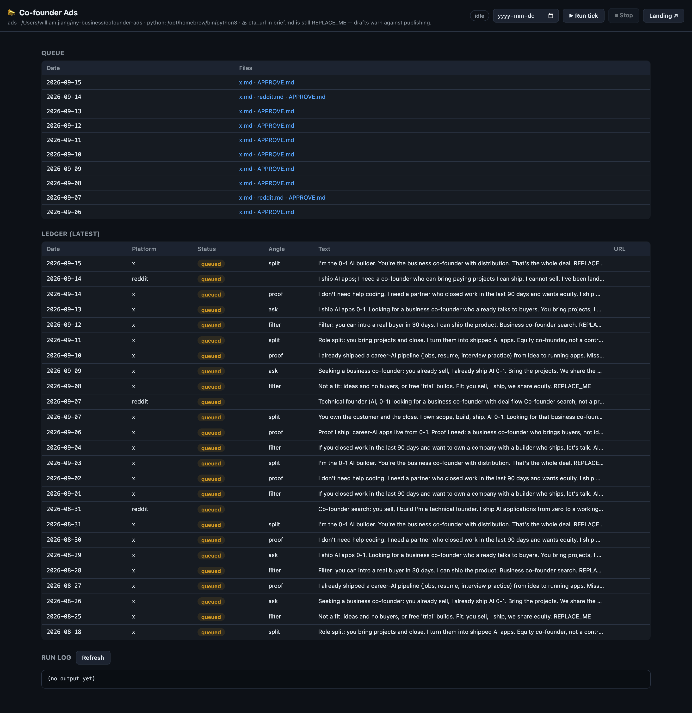
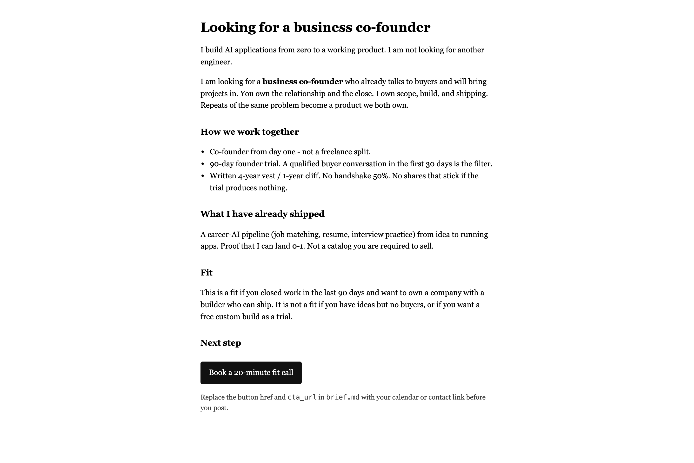

# 合伙人招募贴生成器（X 优先，其次 Reddit）

为「寻找商业合伙人」生成并排队草稿。**任何内容都不会自动发布。** 一次 tick 只负责写字；粘贴到 X（Reddit 到期时同理）的动作由你完成。

只依赖 **Python 3**（纯标准库）。不需要安装什么，见 [docs/cursor_resources.md](docs/cursor_resources.md)。tick 的运行机制见 [docs/cursor_loop.md](docs/cursor_loop.md)。

> English original: [README.md](README.md)

> **当前状态（2026-09-15）：** 引擎可用、每天 09:00 正常出稿，但 `brief.md` 的 `cta_url` 仍是 `REPLACE_ME`，因此发布被强校验拦住 —— 账本里已有 31 条草稿、**0 条已发布**。补一个真实链接是当前唯一的阻塞点。

<!-- screenshots -->
## 界面

界面是本地只读看板，代码在隔壁 `platform` 项目里（`../platform/apps/ads/server.mjs`），注册为监督面板的 `ads` 应用，端口 4901，只监听 `127.0.0.1`。

| 本地看板（queue + ledger） | 落地页 |
|---|---|
|  |  |

看板展示最近 10 天的 queue、最新 ledger 记录，并可以直接触发一次 tick；落地页是 `public/index.html` 的渲染结果。看板只负责展示和排稿，**发布动作仍然由你手动完成**。

```bash
cd ../platform/apps/ads
node server.mjs
# 看板：http://127.0.0.1:4901   落地页：http://127.0.0.1:4901/landing
```

也可以从监督面板统一启动：`cd ../platform && npm start`。
<!-- /screenshots -->

## 消息

你负责把 AI 应用从 0 做到 1。你要找一个能带来项目的商业合伙人。股权优先；vest / cliff 的细节写在 [public/index.html](public/index.html) 里，不放进推文。

## 首次发帖前

1. 把 [brief.md](brief.md) 的 `cta_url` 换成真实页面或日历链接（替掉 `REPLACE_ME`）。把 `public/index.html` 托管出去，或者直接把 `cta_url` 指向你的日历。在这之前 tick 照常运行，但 `APPROVE.md` 会警告你不要发布。
2. 填满队列（在项目根目录执行）：

```bash
python3 -m engine tick
python3 -m engine tick --date 2026-08-18
python3 -m engine --root /path/to/cofounder-ads tick
```

3. 打开 `queue/YYYY-MM-DD/APPROVE.md`。X 的部分：从 `x.md` 复制 **Post** 区块，粘贴到 https://x.com/compose。
4. 发布之后：

```bash
python3 -m engine published --platform x --url 'https://x.com/YOU/status/ID'
python3 -m engine published --platform reddit --url 'https://reddit.com/r/cofounder/comments/ID'
```

记录一条回复：

```bash
python3 -m engine reply --platform x --from '@someone' --note 'asked about equity' --url 'https://x.com/i/status/ID'
```

跳过某条草稿（不发布）：

```bash
python3 -m engine skip --platform x
```

`published` 和 `skip` 修改的是账本里该平台**最后一条 `queued` 记录**（Supabase 的 `ads_ledger`，离线时是 `ledger.csv`）。它们本身不发布任何东西。

> **存储（2026-08-24）：** 设置 `SUPABASE_URL` + `SUPABASE_SECRET_KEY` 后（见 `.env.example`），账本和 CRM 记录存放在 Supabase 表 **`ads_ledger`** / **`ads_crm`**，通过 REST API 读写，不再写 CSV。没有这两个变量时，引擎回落到 `ledger.csv` / `crm.csv`（离线使用与测试套件走这条路径）。建表语句在 `migrations/supabase.sql`；CLI 会自动加载 `.env`，其他不用改。

## 节奏（[calendar.yml](calendar.yml)）

| 平台 | 默认 | 你要做的 |
|---|---|---|
| X | `daily`，已启用 | 审核并发布 |
| Reddit | `weekly`，`weekday: 0`（周一），一个 sub | 审核并发布；先读 [platforms/reddit.md](platforms/reddit.md) |

用 `enabled: false` 关闭某个渠道。可选的每日补稿（cron）：

```bash
0 9 * * * /full/path/to/cofounder-ads/scripts/tick.sh
```

`scripts/tick.sh` 会把多余参数透传给 `python3 -m engine tick`。

> **2026-08-24：** 现在由 launchd 代理自动执行每天 09:00 的 tick（label `com.williamj.ads-tick`）。安装 / 卸载：`scripts/install-launchd.sh` / `UNINSTALL=1 scripts/install-launchd.sh`。
> Supabase 之前的草稿（2026-08-17/18）已标记为 `skipped` 并移到 `queue/archive/`。

## 引擎读取什么

| 输入 | 用途 |
|---|---|
| `brief.md` 的 `cta_url` | 附加到每条草稿。为 `REPLACE_ME` 时触发警告。 |
| `calendar.yml` | 判断当天哪些平台到期 |
| `platforms/x.md` 的 `max_chars` | X 长度上限（默认 280） |
| 账本里的历史 `text` / Reddit `sub` | 近似重复跳过、subreddit 轮换 |

`brief.md` 的前置元数据（front matter）：

- `cta_url` —— 附加到每条草稿。为 `REPLACE_ME` 时触发警告。
- `cta_label` —— Reddit 草稿的 markdown 链接文字（X 用原始 URL，因为 X 帖子没有链接文字）。
- `x_handle` —— 设置后显示在 X 的发布指引里。
- `author_name` —— 作为 Reddit 草稿末尾的署名（"— William"）。

> **2026-08-23 更新：** 引擎现在**拒绝**在 post URL 与 `cta_url` 都是真实链接之前执行 `engine published`（不允许 `REPLACE_ME` / 占位 URL）。原因是早期一次 tick 在 `cta_url` 还是 `REPLACE_ME` 时就把帖子标成了已发布。

X 文案在 `ask` / `proof` / `split` / `filter` 四个角度间轮换；Reddit 在 `r/cofounder` → `r/startups` → `r/indiehackers` 之间轮换。

## 目录结构

- [brief.md](brief.md) —— 报价、证据、角度（**消息**的唯一事实来源）
- [platforms/x.md](platforms/x.md)、[platforms/reddit.md](platforms/reddit.md)、[platforms/_template.md](platforms/_template.md)
- `engine/` —— `tick`、`published`、`skip`、`reply`
- [calendar.yml](calendar.yml)
- `queue/YYYY-MM-DD/` —— `x.md`、`reddit.md`（周一）、`APPROVE.md`
- `ads_ledger`（Supabase）或 `ledger.csv` —— date, platform, status, angle, sub, chars, path, url, text
- `ads_crm`（Supabase）或 `crm.csv` —— date, platform, from_handle, note, url
- `migrations/supabase.sql` —— Supabase 表结构
- `screenshots/` —— 本文件的界面截图（由 screenshot-ui 技能生成）
- [public/index.html](public/index.html) —— 落地页；[public/index.md](public/index.md) 是同样的文案（markdown 版）

## 验证

```bash
python3 -m unittest discover -s tests -v
```

## 这个项目不是什么

不做 Craigslist 机器人。不把同一份文案原样跨平台粘贴。不做自动登录发帖。不引入额外的 Python 依赖。
